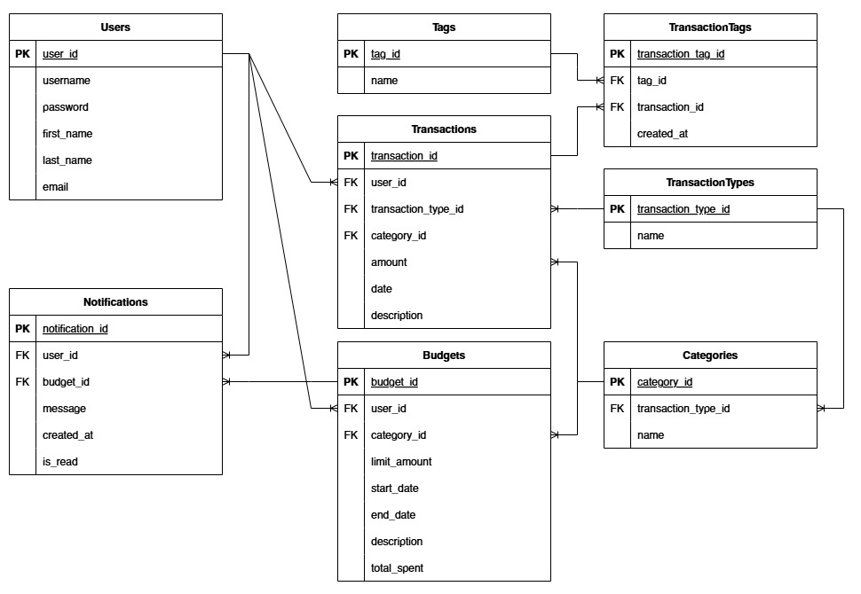

# Лабораторная работа 1. Реализация серверного приложения FastAPI

## Цели

Научится реализовывать полноценное серверное приложение с помощью фреймворка FastAPI с применением дополнительных средств и библиотек.

## Практическая часть

### Описание приложения на тему "Разработка сервиса для управления личными финансами"

#### Структура базы данных



Модель данных включает 8 таблиц:
1. Users - пользователи.
2. TransactionTypes - типы транзакций.
3. Categories - категории транзакций.
4. Budgets - бюджеты пользователей.
5. Notifications - уведомления.
6. Tags - теги для транзакций.
7. Transactions - транзакции.

Связи:
- One-to-Many: `Users` → `Transactions`, `Users` → `Budgets`, `Users` → `Notifications`.
- Many-to-Many: `Transactions` ↔ `Tags` через ассоциативную таблицу `TransactionTags`.
- Ассоциативная сущность: `TransactionTags`.

### Реализация кода

#### Подключение к базе данных (`connection.py`)
Файл настраивает подключение к базе данных, инициализирует таблицы и добавляет начальные данные для категорий, типов транзакций и тегов:

```python
import os  
from dotenv import load_dotenv  
from sqlmodel import SQLModel, Session, create_engine, select  
  
from models import Categories, Tags, TransactionTypeEnums, TransactionTypes  
  
load_dotenv()  
db_url = os.getenv("DB_ADMIN")  
engine = create_engine(db_url, echo = True)  
DEFAULT_TAGS = ["impulse_buy", "planned_buy", "cash", "card"]  
DEFAULT_TRANSACTION_TYPES = ["income", "expense"]  
DEFAULT_CATEGORIES = {  
    "expense": [  
        {"name": "groceries"},  
        {"name": "transport"},  
        {"name": "housing"},  
        {"name": "health"},  
        {"name": "entertainment"},  
        {"name": "other_expenses"},  
    ],  
    "income": [  
        {"name": "salary"},  
        {"name": "investments"},  
    ],  
}  
  
  
def init_db():  
    SQLModel.metadata.create_all(engine)  
    init_default_tags()  
    init_default_transaction_types()  
    init_default_categories()  
  
  
def init_default_tags():  
    with Session(engine) as session:  
        for tag_name in DEFAULT_TAGS:  
            tag_exists = session.exec(select(Tags).where(Tags.name == tag_name)).first()  
            if not tag_exists:  
                session.add(Tags(name = tag_name))  
        session.commit()  
  
  
def init_default_transaction_types():  
    with Session(engine) as session:  
        for tt_name in DEFAULT_TRANSACTION_TYPES:  
            type_exists = session.exec(  
                select(TransactionTypes).where(TransactionTypes.name == tt_name)  
            ).first()  
            if not type_exists:  
                session.add(TransactionTypes(name=tt_name))  
        session.commit()  
  
  
def init_default_categories():  
    with Session(engine) as session:  
        for tx_type_str, categories in DEFAULT_CATEGORIES.items():  
            tx_type = session.exec(  
                select(TransactionTypes).where(TransactionTypes.name == TransactionTypeEnums(tx_type_str))  
            ).first()  
  
            if not tx_type:  
                continue  
  
            for category in categories:  
                exists = session.exec(  
                    select(Categories).where(  
                        Categories.name == category["name"],  
                        Categories.transaction_type_id == tx_type.transaction_type_id  
                    )  
                ).first()  
  
                if not exists:  
                    session.add(  
                        Categories(  
                            name = category["name"],  
                            transaction_type_id = tx_type.transaction_type_id  
                        )  
                    )  
  
        session.commit()  
  
  
def get_session():  
    with Session(engine) as session:  
        yield session
```

#### Главный файл приложения (`main.py`)
Создает приложение FastAPI, подключает маршруты и инициализирует базу данных при запуске:

```python
from fastapi import FastAPI  
  
from connection import init_db  
from routers import auth, budgets, categories, notifications, tags, transactions, users  
  
app = FastAPI()  
  
  
@app.on_event("startup")  
def on_startup():  
    init_db()  
  
  
app.include_router(auth.router)  
app.include_router(budgets.router)  
app.include_router(categories.router)  
app.include_router(notifications.router)  
app.include_router(tags.router)  
app.include_router(transactions.router)  
app.include_router(users.router)  
  
  
@app.get("/")  
def hello():  
    return "Hello, Artur!"
```

#### Модели базы данных (`models.py`)
Определены модели с учётом связей:

```python
from typing import Optional, List  
from sqlmodel import SQLModel, Field, Relationship  
from datetime import datetime  
from enum import Enum  
  
  
class Users(SQLModel, table = True):  
    user_id: Optional[int] = Field(default = None, primary_key = True)  
    username: str = Field(index = True, unique = True)  
    password: str  
    first_name: str  
    last_name: str  
    email: str = Field(unique = True, index = True)  
  
    transactions: List["Transactions"] = Relationship(back_populates = "user")  
    budgets: List["Budgets"] = Relationship(back_populates = "user")  
    notifications: List["Notifications"] = Relationship(back_populates = "user")  
  
  
class TransactionTypeEnums(str, Enum):  
    income = "income"  
    expense = "expense"  
  
  
class TransactionTypes(SQLModel, table = True):  
    transaction_type_id: Optional[int] = Field(default = None, primary_key = True)  
    name: TransactionTypeEnums  
  
    transactions: List["Transactions"] = Relationship(back_populates = "transaction_type")  
    categories: List["Categories"] = Relationship(back_populates = "transaction_type")  
  
  
class Categories(SQLModel, table = True):  
    category_id: Optional[int] = Field(default = None, primary_key = True)  
    transaction_type_id: Optional[int] = Field(default = None, foreign_key = "transactiontypes.transaction_type_id")  
    name: str  
  
    transactions: List["Transactions"] = Relationship(back_populates = "category")  
    budgets: List["Budgets"] = Relationship(back_populates = "category")  
    transaction_type: Optional["TransactionTypes"] = Relationship(back_populates = "categories")  
  
  
class Budgets(SQLModel, table = True):  
    budget_id: Optional[int] = Field(default = None, primary_key = True)  
    user_id: Optional[int] = Field(foreign_key = "users.user_id")  
    category_id: Optional[int] = Field(foreign_key = "categories.category_id")  
    limit_amount: float  
    start_date: datetime  
    end_date: datetime  
    description: Optional[str] = None  
    total_spent: float = Field(default = 0.0)  
  
    user: Optional["Users"] = Relationship(back_populates = "budgets")  
    category: Optional["Categories"] = Relationship(back_populates = "budgets")  
    notifications: List["Notifications"] = Relationship(back_populates = "budget")  
  
  
class Notifications(SQLModel, table = True):  
    notification_id: Optional[int] = Field(default = None, primary_key = True)  
    user_id: Optional[int] = Field(foreign_key = "users.user_id")  
    budget_id: Optional[int] = Field(foreign_key = "budgets.budget_id")  
    message: str  
    created_at: datetime = Field(default_factory = datetime.utcnow)  
    is_read: bool = Field(default = False)  
  
    user: Optional["Users"] = Relationship(back_populates = "notifications")  
    budget: Optional["Budgets"] = Relationship(back_populates = "notifications")  
  
  
class TransactionTags(SQLModel, table = True):  
    transaction_tag_id: Optional[int] = Field(default = None, primary_key = True)  
    tag_id: Optional[int] = Field(foreign_key = "tags.tag_id")  
    transaction_id: Optional[int] = Field(foreign_key = "transactions.transaction_id")  
    created_at: datetime = Field(default_factory = datetime.utcnow)  
  
  
class Tags(SQLModel, table = True):  
    tag_id: Optional[int] = Field(default = None, primary_key = True)  
    name: str  
  
    transactions: List["Transactions"] = Relationship(back_populates = "tags", link_model = TransactionTags)  
  
  
class Transactions(SQLModel, table = True):  
    transaction_id: Optional[int] = Field(default = None, primary_key = True)  
    user_id: Optional[int] = Field(foreign_key = "users.user_id")  
    transaction_type_id: Optional[int] = Field(foreign_key = "transactiontypes.transaction_type_id")  
    category_id: Optional[int] = Field(foreign_key = "categories.category_id")  
    amount: float  
    date: datetime  
    description: Optional[str] = None  
  
    user: Optional["Users"] = Relationship(back_populates = "transactions")  
    transaction_type: Optional["TransactionTypes"] = Relationship(back_populates = "transactions")  
    category: Optional["Categories"] = Relationship(back_populates = "transactions")  
    tags: List["Tags"] = Relationship(back_populates = "transactions", link_model = TransactionTags)
```

#### Схемы Pydantic (`schemas.py`)
Определены модели для валидации данных:

```python
from pydantic import BaseModel, EmailStr, field_validator, validator
from typing import Optional, List
from datetime import datetime

from pydantic_core.core_schema import ValidationInfo


class UserBase(BaseModel):
    username: str
    first_name: str
    last_name: str
    email: EmailStr


class UserCreate(UserBase):
    password: str


class UserRead(UserBase):
    user_id: int

    class Config:
        from_attributes = True


class UserWithToken(BaseModel):
    user: UserRead
    access_token: str
    token_type: str = "bearer"


class UserUpdate(BaseModel):
    first_name: Optional[str]
    last_name: Optional[str]
    email: Optional[EmailStr]


class UserLogin(BaseModel):
    username: str
    password: str


class UserPassword(BaseModel):
    old_password: str
    new_password: str


class TransactionBase(BaseModel):
    amount: float
    date: datetime
    description: Optional[str] = None


class TransactionCreate(TransactionBase):
    transaction_type_id: int
    category_id: int
    tag_ids: Optional[List[int]] = []

    @field_validator('amount')
    def amount_must_be_positive(cls, amount: float):
        if amount <= 0:
            raise ValueError('Amount must be positive')
        return amount


class TransactionUpdate(BaseModel):
    transaction_type_id: Optional[int]
    category_id: Optional[int]
    amount: Optional[float]
    date: Optional[datetime]
    description: Optional[str] = None
    tag_ids: Optional[List[int]]

    @field_validator('amount')
    def amount_must_be_positive(cls, amount: Optional[float]):
        if amount is not None and amount <= 0:
            raise ValueError('Amount must be positive')
        return amount


class TransactionRead(TransactionBase):
    transaction_id: int
    user_id: int
    transaction_type_id: int
    category_id: int
    tags: List['TagRead'] = []

    class Config:
        from_attributes = True


class BudgetBase(BaseModel):
    limit_amount: float
    start_date: datetime
    end_date: datetime
    description: Optional[str] = None


class BudgetCreate(BudgetBase):
    category_id: int

    @field_validator('limit_amount')
    def limit_amount_must_be_positive(cls, limit_amount: float):
        if limit_amount <= 0:
            raise ValueError('Limit amount must be positive')
        return limit_amount

    @field_validator('end_date')
    def check_dates(cls, end_date: datetime, info: ValidationInfo):
        start_date = info.data.get('start_date')  # type: ignore
        if start_date and end_date <= start_date:
            raise ValueError('End date must be after start date')
        return end_date


class BudgetUpdate(BaseModel):
    category_id: Optional[int]
    limit_amount: Optional[float]
    start_date: Optional[datetime]
    end_date: Optional[datetime]
    description: Optional[str] = None

    @field_validator('limit_amount')
    def limit_amount_must_be_positive(cls, limit_amount: Optional[float]):
        if limit_amount is not None and limit_amount <= 0:
            raise ValueError('Limit amount must be positive')
        return limit_amount

    @field_validator('end_date')
    def check_dates(cls, end_date: datetime, info: ValidationInfo):
        start_date = info.data.get('start_date')  # type: ignore
        if start_date and end_date <= start_date:
            raise ValueError('End date must be after start date')
        return end_date


class BudgetRead(BudgetBase):
    budget_id: int
    user_id: int
    category_id: int
    total_spent: float

    class Config:
        from_attributes = True


class NotificationRead(BaseModel):
    notification_id: int
    user_id: int
    budget_id: int
    message: str
    created_at: datetime
    is_read: bool

    class Config:
        from_attributes = True


class CategoryBase(BaseModel):
    name: str


class CategoryRead(CategoryBase):
    category_id: int
    transaction_type_id: int

    class Config:
        from_attributes = True


class TagBase(BaseModel):
    name: str


class TagRead(TagBase):
    tag_id: int

    class Config:
        from_attributes = True


class TransactionTagRead(BaseModel):
    transaction_tag_id: int
    tag_id: int
    transaction_id: int
    created_at: datetime

    class Config:
        from_attributes = True

```

#### Маршруты авторизации (`routers/auth.py`)
Реализованы функции регистрации, логина, проверки токенов и управления паролем:

```python
import datetime
import os
import jwt
from fastapi import APIRouter, HTTPException, Depends, Security, status
from fastapi.security import HTTPBearer, HTTPAuthorizationCredentials
from sqlmodel import Session, select
from passlib.context import CryptContext
from connection import get_session
from models import Users
from schemas import UserCreate, UserRead, UserLogin, UserPassword, UserWithToken

router = APIRouter(prefix = "/auth", tags = ["Authentication"])

SECRET_KEY = os.getenv("SECRET_KEY")
ALGORITHM = os.getenv("ALGORITHM")
ACCESS_TOKEN_EXPIRE_MINUTES = 30

pwd_context = CryptContext(schemes = ["bcrypt"], deprecated = "auto")
auth_scheme = HTTPBearer()


def create_access_token(data: dict, expires_delta: datetime.timedelta = None) -> str:
    payload = data.copy()
    if expires_delta:
        expire = datetime.datetime.now(datetime.timezone.utc) + expires_delta
    else:
        expire = datetime.datetime.now(datetime.timezone.utc) + datetime.timedelta(
            minutes = ACCESS_TOKEN_EXPIRE_MINUTES
        )
    payload.update({"exp": expire})
    encoded_jwt = jwt.encode(payload, SECRET_KEY, algorithm = ALGORITHM)
    return encoded_jwt


def verify_token(token: str) -> str:
    try:
        payload = jwt.decode(token, SECRET_KEY, algorithms = [ALGORITHM])
        return payload.get("sub")
    except jwt.ExpiredSignatureError:
        raise HTTPException(status_code = status.HTTP_401_UNAUTHORIZED, detail = "Token expired")
    except jwt.InvalidTokenError:
        raise HTTPException(status_code = status.HTTP_401_UNAUTHORIZED, detail = "Invalid token")


def create_user_with_hash(user_create: UserCreate, session: Session) -> Users:
    username_statement = select(Users).where(Users.username == user_create.username)
    existing_user = session.exec(username_statement).first()
    if existing_user:
        raise HTTPException(status_code = 400, detail = "Username already registered")

    email_statement = select(Users).where(Users.email == user_create.email)
    existing_email = session.exec(email_statement).first()
    if existing_email:
        raise HTTPException(status_code = 400, detail = "Email already registered")

    hashed_password = pwd_context.hash(user_create.password)

    new_user = Users(
        username = user_create.username,
        password = hashed_password,
        first_name = user_create.first_name,
        last_name = user_create.last_name,
        email = user_create.email
    )
    session.add(new_user)
    session.commit()
    session.refresh(new_user)
    return new_user


def create_user_and_token(user_create: UserCreate, session: Session) -> UserWithToken:
    user = create_user_with_hash(user_create, session)
    token = create_access_token(data = {"sub": user.username})
    return UserWithToken(user = UserRead.model_validate(user), access_token = token)


@router.post("/register", response_model = UserWithToken)
def register(user_create: UserCreate, session: Session = Depends(get_session)):
    return create_user_and_token(user_create, session)


@router.post("/login", response_model = UserWithToken)
def login(user_login: UserLogin, session: Session = Depends(get_session)):
    statement = select(Users).where(Users.username == user_login.username)
    user = session.exec(statement).first()
    if not user or not pwd_context.verify(user_login.password, user.password):
        raise HTTPException(status_code = 401, detail = "Invalid credentials")
    token = create_access_token(data = {"sub": user.username})
    return {
        "user": UserRead.model_validate(user),
        "access_token": token,
        "token_type": "bearer"
    }


def get_current_user(
    credentials: HTTPAuthorizationCredentials = Security(auth_scheme),
    session: Session = Depends(get_session)
) -> Users:
    token = credentials.credentials
    username = verify_token(token)
    statement = select(Users).where(Users.username == username)
    user = session.exec(statement).first()
    if not user: raise HTTPException(status_code = 404, detail = "User not found")
    return user


@router.get("/me", response_model = UserRead)
def read_current_user(current_user: Users = Depends(get_current_user)):
    return current_user


@router.patch("/change-password")
def change_password(
    pwd_data: UserPassword,
    current_user: Users = Depends(get_current_user),
    session: Session = Depends(get_session)
):
    if not pwd_context.verify(pwd_data.old_password, current_user.password):
        raise HTTPException(status_code = 400, detail = "Incorrect current password")
    current_user.password = pwd_context.hash(pwd_data.new_password)
    session.add(current_user)
    session.commit()
    return {"message": "Password updated successfully"}

```

#### Маршруты пользователей (`routers/users.py`)
Реализованы CRUD-операции для пользователей:

```python
from fastapi import APIRouter, Depends, HTTPException
from sqlmodel import Session, select
from connection import get_session
from models import Users
from typing import List
from routers.auth import create_user_and_token
from schemas import UserCreate, UserRead, UserUpdate, UserWithToken

router = APIRouter(prefix = "/users", tags = ["Users"])


@router.post("/", response_model = UserWithToken)
def create_user(user_create: UserCreate, session: Session = Depends(get_session)):
    return create_user_and_token(user_create, session)


@router.get("/", response_model = List[UserRead])
def read_users(session: Session = Depends(get_session)):
    users = session.exec(select(Users)).all()
    return users


@router.get("/{user_id}", response_model = UserRead)
def read_user(user_id: int, session: Session = Depends(get_session)):
    user = session.get(Users, user_id)
    if not user:
        raise HTTPException(status_code = 404, detail = "User not found")
    return user


@router.patch("/{user_id}", response_model = UserRead)
def update_user(user_id: int, user_update: UserUpdate, session: Session = Depends(get_session)):
    user = session.get(Users, user_id)
    if not user:
        raise HTTPException(status_code = 404, detail = "User not found")
    user_data = user_update.dict(exclude_unset = True)
    for key, value in user_data.items():
        setattr(user, key, value)
    session.add(user)
    session.commit()
    session.refresh(user)
    return user


@router.delete("/{user_id}")
def delete_user(user_id: int, session: Session = Depends(get_session)):
    user = session.get(Users, user_id)
    if not user:
        raise HTTPException(status_code = 404, detail = "User not found")
    session.delete(user)
    session.commit()
    return {"message": "User deleted successfully"}

```

#### Маршруты бюджетов (`routers/budgets.py`)

Реализованы CRUD-операции для бюджетов с автоматическим обновлением расходов и уведомлений:

```python
from fastapi import APIRouter, Depends, HTTPException  
from sqlalchemy import delete, func  
from sqlmodel import Session, select  
from connection import get_session  
from models import Budgets, Categories, Notifications, TransactionTypeEnums, TransactionTypes, Transactions, Users  
from schemas import BudgetCreate, BudgetRead, BudgetUpdate  
from routers.auth import get_current_user  
from typing import List  
  
router = APIRouter(prefix = "/budgets", tags = ["Budgets"])  
  
  
@router.post("/", response_model = BudgetRead)  
def create_budget(  
    budget: BudgetCreate,  
    current_user: Users = Depends(get_current_user),  
    session: Session = Depends(get_session)  
):  
    category = session.get(Categories, budget.category_id)  
    if not category:  
        raise HTTPException(status_code = 404, detail = "Category not found")  
    if category.transaction_type.name != TransactionTypeEnums.expense:  
        raise HTTPException(status_code = 400, detail = "Budget can only be set for expense categories")  
  
    db_budget = Budgets(  
        user_id = current_user.user_id,  
        category_id = budget.category_id,  
        limit_amount = budget.limit_amount,  
        start_date = budget.start_date,  
        end_date = budget.end_date,  
        description = budget.description  
    )  
    session.add(db_budget)  
    session.commit()  
    session.refresh(db_budget)  
  
    update_total_spent(  
        category_id = budget.category_id,  
        user_id = current_user.user_id,  
        session = session  
    )  
  
    return db_budget  
  
  
@router.get("/", response_model = List[BudgetRead])  
def read_budgets(  
    current_user: Users = Depends(get_current_user),  
    session: Session = Depends(get_session)  
):  
    statement = select(Budgets).where(Budgets.user_id == current_user.user_id)  
    budgets = session.exec(statement).all()  
    return budgets  
  
  
@router.get("/{budget_id}", response_model = BudgetRead)  
def read_budget(  
    budget_id: int,  
    current_user: Users = Depends(get_current_user),  
    session: Session = Depends(get_session)  
):  
    budget = session.get(Budgets, budget_id)  
    if not budget:  
        raise HTTPException(status_code = 404, detail = "Budget not found")  
    if budget.user_id != current_user.user_id:  
        raise HTTPException(status_code = 403, detail = "Not authorized to view this budget")  
    return budget  
  
  
def update_total_spent(category_id: int, user_id: int, session: Session):  
    expense_type = session.exec(  
        select(TransactionTypes).where(TransactionTypes.name == TransactionTypeEnums.expense)  
    ).first()  
  
    budgets = session.exec(  
        select(Budgets).where(  
            Budgets.category_id == category_id,  
            Budgets.user_id == user_id  
        )  
    ).all()  
  
    for budget in budgets:  
        total = session.exec(  
            select(func.sum(Transactions.amount)).where(  
                Transactions.user_id == budget.user_id,  
                Transactions.category_id == budget.category_id,  
                Transactions.transaction_type_id == expense_type.transaction_type_id,  
                Transactions.date.between(budget.start_date, budget.end_date)  
            )  
        ).first()  
  
        total = total if total is not None else 0.0  
  
        budget.total_spent = total  
        session.add(budget)  
  
        if total <= budget.limit_amount:  
            session.exec(  
                delete(Notifications).where(  
                    Notifications.user_id == budget.user_id,  
                    Notifications.budget_id == budget.budget_id  
                )  
            )  
        else:  
            exists = session.exec(  
                select(Notifications).where(  
                    Notifications.user_id == budget.user_id,  
                    Notifications.budget_id == budget.budget_id  
                )  
            ).first()  
            if not exists:  
                session.add(  
                    Notifications(  
                        user_id = budget.user_id,  
                        budget_id = budget.budget_id,  
                        message = (  
                            f"Бюджет по категории «{budget.category.name}» превышен: "  
                            f"потрачено {total}, лимит {budget.limit_amount}"  
                        )  
                    )  
                )  
    session.commit()  
  
  
@router.patch("/{budget_id}", response_model = BudgetRead)  
def update_budget(  
    budget_id: int,  
    budget_update: BudgetUpdate,  
    current_user: Users = Depends(get_current_user),  
    session: Session = Depends(get_session)  
):  
    budget = session.get(Budgets, budget_id)  
    if not budget:  
        raise HTTPException(status_code = 404, detail = "Budget not found")  
    if budget.user_id != current_user.user_id:  
        raise HTTPException(status_code = 403, detail = "Not authorized to update this budget")  
  
    data = budget_update.dict(exclude_unset = True)  
    if 'category_id' in data:  
        category = session.get(Categories, data['category_id'])  
        if not category or category.transaction_type.name != TransactionTypeEnums.expense:  
            raise HTTPException(status_code = 400, detail = "Invalid expense category")  
    for k, v in data.items():  
        setattr(budget, k, v)  
    session.add(budget)  
    session.commit()  
    session.refresh(budget)  
  
    update_total_spent(  
        category_id = budget.category_id,  
        user_id = current_user.user_id,  
        session = session  
    )  
    return budget  
  
  
@router.delete("/{budget_id}")  
def delete_budget(  
    budget_id: int,  
    current_user: Users = Depends(get_current_user),  
    session: Session = Depends(get_session)  
):  
    budget = session.get(Budgets, budget_id)  
    if not budget:  
        raise HTTPException(status_code = 404, detail = "Budget not found")  
    if budget.user_id != current_user.user_id:  
        raise HTTPException(status_code = 403, detail = "Not authorized to delete this budget")  
    session.delete(budget)  
    session.commit()  
    return {"message": "Budget deleted successfully"}
```


### Пример использования:

- Пользователь **Alex Johnson** создает бюджет на категорию "groceries" с лимитом 350. После добавления транзакций на 200 и 250 (итого 450), система автоматически обновляет `total_spent` и создает уведомление о превышении бюджета.
- Пользователь **Bob Smith** управляет бюджетом на "housing", где транзакция на 850 не превышает лимит 1000, и уведомление не создается.

## Результат

Приложение успешно реализует базовый функционал для сервиса личных финансов. Все требования задания выполнены.