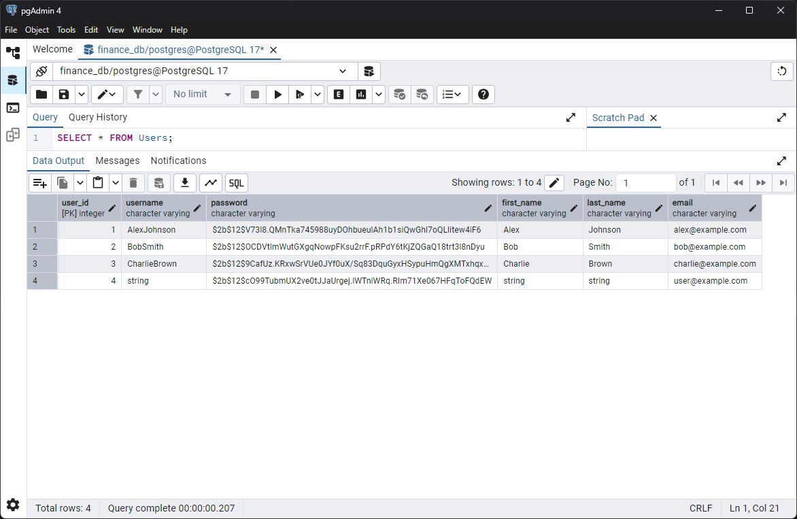
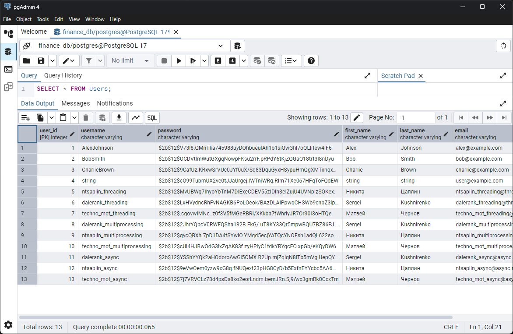

# Лабораторная работа 2. Потоки. Процессы. Асинхронность

## Задача 1. Различия между threading, multiprocessing и async в Python

**Задача:** Напишите три различных программы на Python, использующие каждый из подходов: threading, multiprocessing и async. Каждая программа должна решать считать сумму всех чисел от 1 до 1000000000. Разделите вычисления на несколько параллельных задач для ускорения выполнения.

**Результаты выполнения**

| Подход          | Время выполнения (сек) |
| --------------- | ---------------------- |
| Threading       | 11.04                  |
| Multiprocessing | 3.62                   |
| Async           | 12.11                  |

1. **Threading**

    Потоки в Python работают в рамках одного процесса и разделяют общую память. Однако, из-за глобальной блокировки интерпретатора (GIL), в одном потоке может выполняться только один фрагмент Python-кода. Это означает, что даже при наличии нескольких ядер процессора, многозадачность в Python через потоки не даёт реального параллелизма для вычислительных задач. В результате, несмотря на наличие потоков, вычисления выполняются последовательно, что не позволяет достичь значительного прироста скорости.
 
2. **Multiprocessing**

    В отличие от потоков, каждый процесс в multiprocessing имеет свой собственный интерпретатор Python и память, что позволяет обойти ограничения GIL. Каждый процесс работает на отдельном ядре процессора, что даёт значительный прирост в производительности при вычислениях, особенно для задач, требующих интенсивных вычислений. Этот подход позволяет реально использовать многозадачность и параллелизм.

3. **Async**

    Асинхронный подход в Python использует одну нить для выполнения нескольких задач, при этом переключение между задачами происходит только в точках ожидания (await). Это особенно эффективно для ввода-вывода, когда задачи могут ожидать завершения операций, например, сетевых запросов. Однако в задачах, требующих интенсивных вычислений, асинхронность не даёт значительного прироста производительности, поскольку переключения между задачами происходят только в точках ожидания, а не в момент активных вычислений.

## Задача 2. Параллельный парсинг веб-страниц с сохранением в базу данных
**Задача:** Напишите программу на Python для параллельного парсинга нескольких веб-страниц с сохранением данных в базу данных с использованием подходов threading, multiprocessing и async. Каждая программа должна парсить информацию с нескольких веб-сайтов, сохранять их в базу данных.

**Подробности задания:**
1. Напишите три различных программы на Python, использующие каждый из подходов: threading, multiprocessing и async.
2. Каждая программа должна содержать функцию parse_and_save(url), которая будет загружать HTML-страницу по указанному URL, парсить ее, сохранять заголовок страницы в базу данных и выводить результат на экран.
3. Используйте базу данных из лабораторной работы номер 1 для заполенния ее данными. Если Вы не понимаете, какие таблицы и откуда Вы могли бы заполнить с помощью парсинга, напишите преподавателю в общем чате потока.
4. Для threading используйте модуль threading, для multiprocessing - модуль multiprocessing, а для async - ключевые слова async/await и модуль aiohttp для асинхронных запросов.
5. Создайте список нескольких URL-адресов веб-страниц для парсинга и разделите его на равные части для параллельного парсинга.
6. Запустите параллельный парсинг для каждой программы и сохраните данные в базу данных.
7. Замерьте время выполнения каждой программы и сравните результаты.

**Результаты выполнения**

| Подход          | Время выполнения (сек) |
| --------------- | ---------------------- |
| Threading       | 0.41                   |
| Multiprocessing | 1.77                   |
| Async           | 0.71                   |

1. **Threading**

    Потоки в Python используют один процесс для выполнения нескольких задач параллельно, что предполагает совместное использование памяти. Несмотря на наличие потоков, из-за GIL каждый поток выполняется только один фрагмент кода за раз. Это ограничение делает потоки неэффективными для вычислительных задач, но их использование эффективно при работе с I/O, как в случае с веб-запросами.
    
    В данной задаче, благодаря многозадачности потоков, каждый поток выполняет парсинг веб-страницы и сохраняет данные в базу. Обработка нескольких страниц параллельно сократила время выполнения программы до 0.41 секунд. Однако, реальный параллелизм не был достигнут, поскольку операции ввода-вывода, такие как загрузка страниц, не являются интенсивными вычислениями и эффективно делятся между потоками.

2. **Multiprocessing**

    Многозадачность с помощью процесса позволяет каждому процессу работать в своем собственном адресном пространстве, и каждый процесс может использовать отдельное ядро процессора. Это помогает избежать ограничений, связанных с GIL, и позволяет использовать параллельную обработку данных для интенсивных вычислений. Однако, для задач, которые в основном используют ввод-вывод, как парсинг веб-страниц, создание новых процессов может быть менее эффективным из-за накладных расходов на создание и уничтожение процессов.
    
    В данном случае, несмотря на возможность реального параллелизма, использование multiprocessing для веб-запросов привело к более высокому времени выполнения в 1.77 секунд. Это объясняется тем, что накладные расходы на управление процессами и синхронизацию данных между ними оказались более значительными, чем преимущества параллельной обработки.

3. **Async**

    Асинхронность позволяет выполнять несколько операций, не блокируя выполнение программы. В отличие от потоков, где выполнение блокируется на время ожидания ответа, асинхронная программа продолжает работать, ожидая завершения ввода-вывода, что делает ее эффективной для задач, требующих большого числа сетевых запросов.
    
    Для асинхронной обработки использовалась библиотека aiohttp, что позволило добиться хорошей производительности при парсинге веб-страниц. Однако, как и в случае с потоками, в асинхронных приложениях процесс выполнения блокируется только при ожидании ввода-вывода, что позволяет достичь большего контроля над параллельностью. Время выполнения составило 0.71 секунды, что лучше, чем у multiprocessing, но немного хуже, чем у threading.

Таблица Users до добавления пользователей

Таблица Users после добавления пользователей

