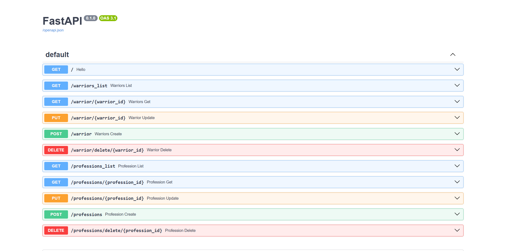

# Практика 1.1. Создание базового приложения на FastAPI

В рамках практики я разработал приложение на FastAPI с временной базой данных, включающей воинов и профессии. Реализовал CRUD-операции для обоих типов данных, используя Pydantic для валидации структуры. Все эндпоинты протестированы через автогенерируемую документацию по адресу `127.0.0.1:8000/docs`.

## Практическая часть

### Временная база данных

В `main.py` созданы две временные базы: `temp_bd` для воинов и `professions` для профессий.

```python
professions = [  
    {  
        "id": 1,  
        "title": "Влиятельный человек",  
        "description": "Эксперт по всем вопросам",  
    }  
]  
  
temp_bd = [  
    {  
        "id": 1,  
        "race": "director",  
        "name": "Мартынов Дмитрий",  
        "level": 12,  
        "profession": {  
            "id": 1,  
            "title": "Влиятельный человек",  
            "description": "Эксперт по всем вопросам"  
        },  
        "skills":  
            [{  
                "id": 1,  
                "name": "Купле-продажа компрессоров",  
                "description": ""  
            },  
                {  
                    "id": 2,  
                    "name": "Оценка имущества",  
                    "description": ""  
                }]  
    },  
    {  
        "id": 2,  
        "race": "worker",  
        "name": "Андрей Косякин",  
        "level": 12,  
        "profession": {  
            "id": 1,  
            "title": "Дельфист-гребец",  
            "description": "Уважаемый сотрудник"  
        },  
        "skills": []  
    },  
]
```

### Модели Pydantic

В файле `models.py` определены модели для структурирования данных:

```python
from enum import Enum  
from typing import Optional, List  
  
from pydantic import BaseModel  
  
  
class RaceType(Enum):  
    director = "director"  
    worker = "worker"  
    junior = "junior"  
  
  
class Profession(BaseModel):  
    id: int  
    title: str  
    description: str  
  
  
class Skill(BaseModel):  
    id: int  
    name: str  
    description: str  
  
  
class Warrior(BaseModel):  
    id: int  
    race: RaceType  
    name: str  
    level: int  
    profession: Profession  
    skills: Optional[List[Skill]] = []
```

### Эндпоинты для воинов

Реализованы CRUD-операции для воинов в `main.py`:

- **Получение списка воинов:**
```python
@app.get("/warriors_list")  
def warriors_list() -> List[Warrior]:  
    return temp_bd
```

- **Получение конкретного воина:**
```python
@app.get("/warrior/{warrior_id}")  
def warriors_get(warrior_id: int) -> List[Warrior]:  
    return [warrior for warrior in temp_bd if warrior.get("id") == warrior_id]
```

- **Добавление воина:**
```python
@app.post("/warrior")  
def warriors_create(warrior: Warrior):  
    warrior_to_append = warrior.model_dump()  
    temp_bd.append(warrior_to_append)  
    return {"status": 200, "data": warrior}
```

- **Удаление воина:**
```python
@app.delete("/warrior/delete/{warrior_id}")
def warrior_delete(warrior_id: int):
    for i, warrior in enumerate(temp_bd):
        if warrior.get("id") == warrior_id:
            temp_bd.pop(i)
            break
    return {"status": 201, "message": "deleted"}
```

- **Обновление воина:**
```python
@app.put("/warrior/{warrior_id}")  
def warrior_update(warrior_id: int, warrior: Warrior) -> List[Warrior]:  
    for war in temp_bd:  
        if war.get("id") == warrior_id:  
            warrior_to_append = warrior.model_dump()  
            temp_bd.remove(war)  
            temp_bd.append(warrior_to_append)  
    return temp_bd
```

### Эндпоинты для профессий

Реализованы CRUD-операции для профессий в `main.py`:

- **Получение списка профессий:**
```python
@app.get("/professions_list")  
def profession_list() -> List[Profession]:  
    return professions
```

- **Получение конкретной профессии:**
```python
@app.get("/professions/{profession_id}")  
def profession_get(profession_id: int) -> List[Profession]:  
    return [profession for profession in professions if profession.get("id") == profession_id]
```

- **Создание профессии:**
```python
@app.post("/professions")  
def profession_create(profession: Profession):  
    profession_dict = profession.model_dump()  
    professions.append(profession_dict)  
    return {"status": 200, "data": profession}
```

- **Удаление профессии:**
```python
@app.delete("/professions/delete/{profession_id}")  
def profession_delete(profession_id: int):  
    for i, profession in enumerate(professions):  
        if profession.get("id") == profession_id:  
            professions.pop(i)  
            break  
    return {"status": 201, "data": "deleted"}
```

- **Обновление профессии:**
```python
@app.put("/professions/{profession_id}")  
def profession_update(profession_id: int, profession: Profession) -> List[Profession]:  
    for prof in professions:  
        if prof.get("id") == profession_id:  
            profession_to_append = profession.model_dump()  
            professions.remove(prof)  
            professions.append(profession_to_append)  
    return professions
```

## Результат

Все эндпоинты доступны и протестированы через документацию FastAPI:

